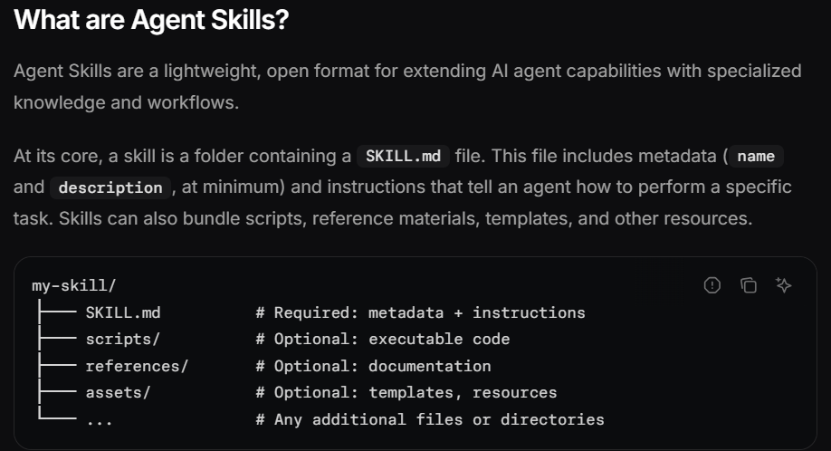

# WEEK5

## Having my-skill/ folder
And making all the documenttions be linked to a short table in the starting eith oly title nd link to the material for quick refernce without needing to go for the reading of the whole documentation.  reference by ids.

Example: Loading a PDF processing skill
Here's how Claude loads and uses a PDF processing skill:
Startup: System prompt includes: PDF Processing - Extract text and tables from PDF files, fill forms, merge documents
User request: "Extract the text from this PDF and summarize it"
Claude invokes: bash: read pdf-skill/SKILL.md → Instructions loaded into context
Claude determines: Form filling is not needed, so FORMS.md is not read
Claude executes: Uses instructions from SKILL.md to complete the task

The diagram shows:

Default state with system prompt and skill metadata pre-loaded
Claude triggers the skill by reading SKILL.md via bash
Claude optionally reads additional bundled files like FORMS.md as needed
Claude proceeds with the task

Extra features: 
Invocation control: disable-model-invocation (only you can trigger it, e.g. /deploy — you don't want the model deciding to deploy) vs. user-invocable: false (only the model, for background knowledge).
Arguments: /fix-issue 123 substitutes 123 into the body via a $ARGUMENTS placeholder.
Dynamic context: a !`git diff HEAD` line in the body runs before the model sees it, so the skill arrives with live data already inlined.
allowed-tools: pre-approving specific tools while a skill is active, so it doesn't re-prompt.
Running in a subagent (context: fork): the skill body becomes a fresh subagent's whole task — the exact Explore-subagent pattern from Week 4 Lesson 5.
 

 
 

 https://code.claude.com/docs/en/skills#control-who-invokes-a-skill

Background jobs:

 🚀 New Features ImplementedInterrupt-to-Background (Ctrl+C): You no longer have to stare at a frozen terminal during long npm install or pytest runs. You can interrupt a running command and seamlessly push it to the background without killing the process.Daemon Job Monitoring: A silent background thread continuously watches your async jobs and captures their output the moment they finish.Agent Polling: The LLM is now aware of background tasks. It can check their status using the check_background_job tool and move on to other todo items while it waits.Notification System: High-level progress (like marking a todo complete or finishing a prompt) is logged to a centralized .agent/notifications.log file, keeping the terminal clean.CLI Notification Bar: You can type /notifs in your REPL at any time to see the last 5 major updates from the agent.🔄 The Code Flow: How It Works End-to-EndExecution Request: The agent decides to run a command and calls run_command.  Safety & Classification: exec.py intercepts this. It checks if it's destructive (asking for y/n) and if it's a known slow command (like pytest).  The Intercept (The Magic): If the command is slow, exec.py starts it and waits. If you hit Ctrl+C because it's taking too long, it catches the KeyboardInterrupt. It prompts you to push it to the background.  Asynchronous Handoff: If you press b, the process is saved to BACKGROUND_JOBS with a unique Job ID, and control is instantly returned to the agent with a message to check back later.  Silent Monitoring: The daemon thread (_job_monitor) in exec.py continuously polls running jobs. When one finishes, it saves the exit code and logs.  Task Completion & Logging: The agent checks the job using check_background_job. Once verified, it calls mark_todo(..., status="completed"). Inside plan.py, this triggers log_notification(), writing a clean success message to .agent/notifications.log.User Visibility: You type /notifs in the REPL. agent.py reads the log file and prints the latest updates so you know exactly what the agent achieved while you weren't looking

tui updated with the notif thingy
 Key Additions Made:Added Imports: Included os and the necessary Textual screen/container widgets (ModalScreen, Container) at the top of the file.  The NotificationModal Class: Inserted a new class defining the floating window, styled to display directly in the middle of the screen over the chat interface. It reads up to the last 15 lines from the .agent/notifications.log file.  New Binding: Added "ctrl+n" to the BINDINGS list in TUIAgent so the hotkey hint appears dynamically in the footer.  Action Method: Defined action_show_notifications(self) at the bottom of the TUIAgent class to trigger the push_screen logic whenever Ctrl+N is pressed. 

 Dynamic "Thinking" Indicator: You built a custom, blinking ai is thinking... text indicator. The neat part is your logic handles it perfectly—it turns on when the request fires, stays on while tools are executing, and smartly clears out when the final message arrives or an error occurs.

Dedicated Tool Trace Panel: You added a completely new UI section on the right side (#tool-container). Instead of cluttering the main chat, all backend tool executions and their results are now routed directly to this dedicated RichLog.

Toggleable Shortcuts Menu: You created a hideable middle panel that lists all your keyboard bindings. You also wired up the H key to dynamically toggle the .-hidden CSS class, letting you show or hide the menu on the fly.

Manual Memory Management (Save & Retrieve): You added two powerful new keyboard actions. Pressing S formats your current conversation and saves it as a Markdown file in a notes directory. Pressing R reads all those saved .md files and injects them straight into the agent's system prompt so it "remembers" past research.

Live Clock & Persistent Hints: You enabled show_clock=True in the Header with a 1-second update interval to show the live date, and you added a persistent bottom bar (#persistent-hint) so the user always knows how to open the shortcuts menu.

Tool Execution Wiring: You fully implemented the execution loop for three specific tools (web_search, web_fetch, and save_research_note). The script now successfully intercepts the tool calls from DeepSeek, runs your local Python functions, and feeds the responses back into the chat history array.

Chat Reset: You added a quick C shortcut that clears the UI logs and wipes the agent's memory array back to just the base system prompt.

1. Injecting Session Info (TUI Only)
If you want to start a new session but give the agent the context of a past session, you use the notes injection system built into your Textual UI.

Export the old session: While inside the session you want to remember, press Ctrl+S. This formats the current chat history and saves it as a Markdown file in your local notes/ directory.  
PY
+ 1

Inject into the new session: Start a brand new TUI session and press Ctrl+R. This command reads all the exported files in the notes/ folder and appends them to the agent's current memory array as a massive system prompt labeled "BACKGROUND KNOWLEDGE MANIFEST".  
PY
+ 1

The agent will now seamlessly know everything from those past sessions without overwriting your current chat UI.

2. Loading a Session Completely
If you want to completely overwrite your current workspace and jump back into an old conversation exactly where you left off, you need to load/resume it.

In the Terminal REPL:

Type /sessions to view a list of all saved session IDs and their titles.  
PY

Type /resume <session_id> (e.g., /resume abc123xy). This uses the load_session function to completely replace your active self.messages array with the history of the targeted session.  
PY
+ 1

In the TUI:
Because the TUI does not currently have a /resume text command mapped in its input handler, you must load the session right when you boot up the app from the terminal by passing the ID as an argument:
python agent.py --tui <session_id>  
PY
+ 1

switching between the tui and repl type in between session.

1. Bidirectional Interface Switching (/tui & /repl)
You can now seamlessly bounce between the terminal and the visual dashboard without losing your conversation history.

In agent.py: Added a /tui (or /ui) slash command inside the REPLAgent loop. When typed, it pauses the terminal, passes your current session_id to the Textual app, and launches the visual dashboard.

In tui.py: Added a /repl command interceptor. When typed in the UI's input box, it safely shuts down the Textual app by triggering self.exit(result="SWITCH_TO_REPL").

In agent.py (Main & Loop): Updated both the REPLAgent loop and the main() block to catch that "SWITCH_TO_REPL" signal so it smoothly drops you back to the exact terminal prompt you left off at.

2. Session Deletion Logic
You can now purge old or cluttered sessions directly from the interface.

Backend: Added a delete_session(session_id) function in agent.py that physically deletes the JSON file from the .agent/sessions directory.

Tool Engine: Mapped "delete_session": delete_session inside the dispatch method so the AI can use it (assuming you updated your schema.py).

REPL Support: Added a /delete <id> command in the terminal loop. If you delete the active session, it automatically spawns a fresh, untitled session for you to continue working in.

TUI Support: Added a /delete <id> interceptor in tui.py. It provides color-coded feedback in the RichLog and instantly purges the active context if you delete the session you are currently viewing.

3. UI and Placeholder Updates
Updated the placeholder text in the TUI's input box to clearly show the new capabilities: Ask agent, /delete <id>, or /repl to switch back...

Updated the REPL's welcome message to show the new slash commands.

Maintained the self.presentation_hook wiring so all background tool executions (like grepping or reading files) properly trigger the _emit_ui method and render cleanly in the TUI's right-hand "Tool Trace Engine" panel.

have to add the spinner thingy' animation

>> the notes one are saved in notes after ctrl s
about  the save 1 and save 2 with only user 