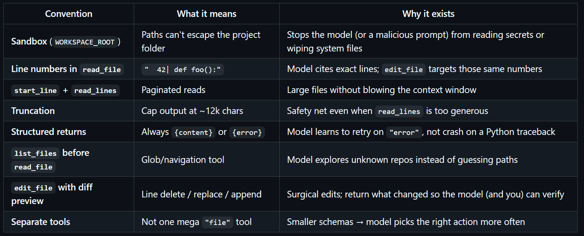

# -WEEK3-

## Built1-
- Here we are creating, saving, loading chat sessions. 
- Chat sessions are stored in Json format, each have there own unique id of 8 char, which has been generated by the nanoid .
- We are also simultaneously building system prompt throughout all the sessions and appending and saving it in a agent.md 
- and have it appended in the base system prompt.

---

## Built2- 
- implement all built 1 functions and save the conversations. pretty much a smaller version 
of main project, it is just that it is done in a single file. 

### File Tools-
The agent class imports some file tool conventions. Which are used to effectcively help in the working


Some problems and their solutions:
-- Disadvantages of simple read/ write tools:
-- Model might edit wrong lines hence have to make the model read then edit the files.
-- Have to be careful when we have to write or edit a file and chose its specific functions.
-- large files floods the context window hence should read a window of lines at once and if cant find the answer then move to next. And have their line numbers written with them.
-- Model should not be able to acess out of the project directory or the directory befor it and make changes in them, to protect them we be using resolve_path the sandbox.

---

## Project-


### three main components :

-Agent- : This is the main class , it creates new session ids, saves the chat history,connects through OpenRouter ai,
checkt for tools and loops throuh its requests, and then run them. Like reading, editing ets.

-REPLAgent- : Read Eval Print Loop Agent , it doesnt loads the tui hence is fast and includes custom made slash commands like
/sessions /resume

-TUIAgent- : it is in another file but in the same directory as agent.py .
It inherits from Agent class. And done its interface through textual.


#### Work Flow-

- initializes all lib and registering the tools.

- main() :
runs any if we have --tui then it imports the TUIAgent and opens the double panel display in it.
Or if someone has written a one liner like this ```python agent.py "Hello"```  then it will reply and 

- It is this python agent.py than it the normla lool with tui.

- gGent.__init__:
check smemory if session_id is there then it will load_session and restore the past conversations.
If nor, it will call create_Session generates a random iD from nanoid .

- REAPLAgent.run(): 
takes the user input , it it has any /commands it handeles it immediately without approaching the ai.
If it is a normal text message it is send over to self.chat(user_input)

- chat() & _run_loop():
Adds title if it is untitled.
Appends msgs to the memory.
It enters _run_loo() it takes the entire conversation history  
with the tools menu decides how to answer or use tools.

- despatch():
if tool usage is there it is send over to dispatch() 
Appropriate tools are used here.
Final result is stored as dictionary where role: tool

- if final nswer is received with no longer looping and call for tools 
then it will save the final history to the disk with save_session() in json files
then the final result is printed through the REPLAgent or TUIAgent.


### How to open TUI:
- step1: Currently in ```week3/project```
- step2: ```python agent.py --tui```

### How to use prevoius chat sessions:
- step1: Currently in ```week3/project```
- step2: ```python agent.py```
- step3: ```/sessions```
- step4: there will be a drop down of sessions with title pich its id
- step5: ```ctrl+c``` to quit it 
- step6: ```python agent.py --tui id ```

### Some eror handling being done-


---

##  Summary of System Changes

The core agent logic has been decoupled from utility functions to establish a clean separation of concerns. 
Below is the mapping of core tasks, their targets, and architectural placements.

| Feature / Task | Target File | Action Taken | Strategic Benefit |
| :--- | :--- | :--- | :--- |
| **1. Custom Persona** | `AGENTS.md` | Created a specialized directive file. | Injects tone rules (witty, concise) and operational safety guidelines dynamically into the system prompt. |
| **2. True Auto-Title** | `agent.py` | Updated `chat()` loop with an LLM-driven sub-routine. | Replaced crude string slicing with a context-aware, 5-word maximum session summary powered by the model. |
| **3. API Key Template** | `.env_example` | Created a standardized environment template. | Documents required external dependencies (`OPENROUTER_API_KEY`, `SERPER_API_KEY`) safely without exposing production secrets. |
| **4. Tool Migration** | `tools/files.py` | Created module and abstracted file handling. | Strips the filesystem logic out of the main loop, making `agent.py` light, clean, and easier to maintain. |
| **5. Safety Gate** | `tools/files.py` | Added interactive CLI confirmation (`y/n`). | Establishes a Human-in-the-Loop (HITL) manual verification gate to prevent automated destructive mutations to disk. |
| **6. Arxiv Fallback** | `tools/papers.py` | Integrated `web_fetch` exception pipeline. | Prevents pipeline breaks by falling back to raw HTML scraping of arXiv abstract pages when official APIs throw 404s. |
| **7. Architecture Notes** | `SUBMISSION.md` | Documented design justifications. | Summarizes critical technical implementations like line-numbered reads and workspace sandboxing for grading/review. |
| **8. Schema Migration** | `tools/schema.py` | Moved `TOOLS` definition block. | Removes over 100 lines of static JSON schemas from the core execution script, establishing clean module boundaries. |

---

## Error Handling, Security, & Edge-Case Refactoring

| File | Vulnerability / Edge Case | Root Cause | Engineering Solution |
| :--- | :--- | :--- | :--- |
| **`agent.py`** | **Upstream API Validation Crashes** | When invoking tools, the assistant's response payload text (`content`) is explicitly `None`. Passing `exclude_none=True` completely dropped the key from the payload dictionary, causing schema validation failures on OpenRouter routers. | Removed `exclude_none=True` on `msg.model_dump()`. This forces the outgoing dictionary to preserve `"content": null`, satisfying strict upstream API expectations. |
| **`agent.py`** | **Command Line Tokenization Failures** | Parsing session resumes via a strict space delimiter (`.split(" ")[1]`) breaks if the user inputs trailing whitespace or an unexpected double-space sequence. | Switched string slicing to `.split(maxsplit=1)` and applied `.strip()`. This cleanly isolates the core ID token while ignoring arbitrary whitespace patterns. |
| **`agent.py`** | **JSON Memory Corruption** | If a user request contained quotation marks, the subsequent LLM title generation routine occasionally generated titles containing raw internal quotes, corrupting the nested JSON session logs upon serialization. | Appended a strict string transformation filter (`.replace('"', '')`) directly to the title generation channel to safely sanitize inputs before disk writes. |
| **`tools/files.py`**| **Path Traversal Security Exploit** | An unrestricted or hallucinating LLM could pass relative system arguments (e.g., `../../etc/passwd`) to read or overwrite critical files outside the project workspace. | Developed the `resolve_path()` guardrail function using `os.path.normpath`. It strictly validates that every resolved absolute path explicitly starts with the `WORKSPACE_ROOT` folder hierarchy. |
| **`tools/files.py`**| **Missing Directory Write Faults** | Python's native `open(..., 'w')` function raises an immediate runtime exception if an agent attempts to write a file inside a path containing directories that do not yet exist. | Integrated `os.makedirs(os.path.dirname(abs_path), exist_ok=True)` immediately prior to file generation loops, abstracting directory trees automatically. |
| **`tools/papers.py`**| **Runtime NameErrors** | The paper utility module called `urllib.parse.quote()` to ensure clean URL safety for academic queries containing spaces, but omitted the underlying package import block. | Inserted `import urllib.parse` at the head of the script to resolve internal symbol table dependencies. |
| **`tools/papers.py`**| **Data Deprivation & API Dropouts** | Academic lookup pipelines were completely fragile to Hugging Face API coverage gaps, yielding unhandled exceptions when requesting newly posted or niche arXiv IDs. | Built a resilient cascading exception block (`try/except`). If the standard endpoint throws a 404, an emergency scraping pipeline is initialized to capture data directly via `web_fetch`. |

---