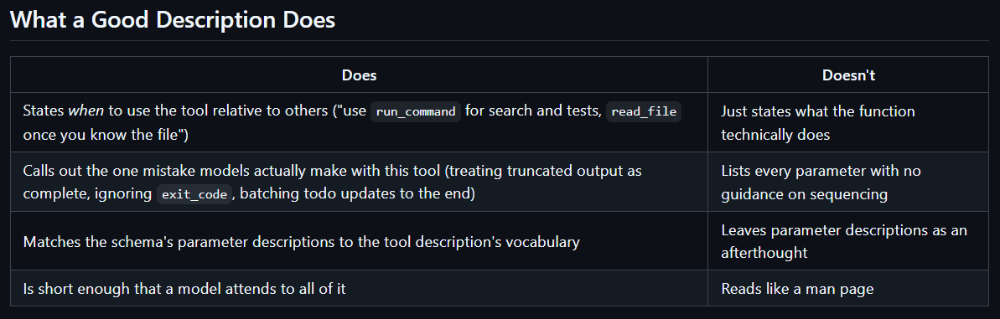
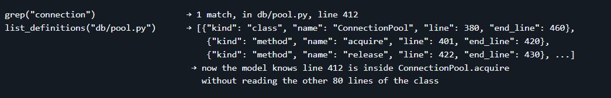
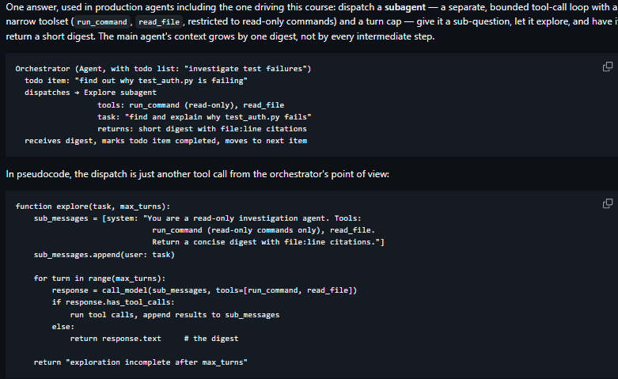

# -WEEk4-

## Theory:

When an agent has been given a task to verify if it really did the work there can be four types of strictness for checking:
- 1. In one prompt: EXplicitly telling it in tge prompt to check whether its answer is correct and do not reply the final ans until all its fixes are correct.
- 2. goal comdition - to set a background rule , As the AI works turn-by-turn, an automated evaluator constantly checks that goal. The AI is literally not allowed to declare the task finished until that background goal is met.
- 3. another ai: check one ai models reply through an another ai model.
- 4. hook: This is a hard-coded programmatic block. A "hook" is a script that runs automatically when a specific event happens. Here, when the AI tries to execute a "Stop" command, your script runs a real test (like npm test). If the test fails, the AI is blocked from stopping and forced to try again. (The text notes it will force-stop after 8 failed attempts so the AI doesn't get stuck in an infinite loop).

Recommended workflow:
- 1. Explore: Tell the agent the problem statement let it read thr required field of files without editing anything.
- 2. Plan:  Ask it how will it do the required task, and its workflow. And have it in a text editor. Msking s todo list.
- 3. Implement: Letting it implement.
- 4. Commit:  Asking it the commit the changes with a description.

## shell commands-

Shell command bifercation in 1. Know read-only, 2. Known destructive- ask permission before perform 3. anything unclassifies.

- using sandbox method and resolve path to safeguard the outer files but is not 100% correct as if paths are used through environment variables or pipes or command substitution then it wont be identifieble.
- they are stateless and always starts fresh wont carry process from before for eg cd dosent persist.
- so why to write the tools for these shell commands ? - it is to get a precise json formatted answer instead of raw text which needs to be filter out.

- The Truncation Trap (stdout vs. stderr)
When your AI runs a terminal command, the terminal spits out two different streams of text:

stdout (Standard Output): The normal results of the command (e.g., a list of 10,000 files).

stderr (Standard Error): The error messages if something breaks.

Because LLMs have context limits, developers usually truncate (cut off) the output if it gets too long. The problem: Imagine a command prints 5,000 lines of normal text, and then crashes at the very end, throwing an error. If you truncated the output at 1,000 lines, the AI will see an exit_code: 1 (which means "I crashed"), but the actual error message was chopped off. The AI is left totally blind as to why it failed.

The Fix: Cap the stdout so the context window doesn't explode, but never truncate stderr. Always feed the full error message back to the AI so it can debug itself.

- clearly specify and mention all the tool, be descriptive and dont be vague with the description or the agent wont use the tool. 

## How real agents actually find code:

- 1. grep-first: but will require a exact file name and all , zero setup, fast.
If we are working in it with a single file then pair it with `list_definitions`

- 2. Embedding/RAG: This allows the AI to search by concept rather than exact characters. It's incredibly powerful for large codebases where you might not know the exact variable names, but maintaining that vector database cache introduces a massive layer of state-syncing headaches. If the index is stale, the AI goes crazy.

- 3. Repo maps: Tools like Aider use Abstract Syntax Trees (ASTs) to map out how functions and files connect. It gives the AI a "bird's-eye view" of the project's architecture. It's brilliant for understanding structure, but terrible for finding a specific hardcoded string or comment.

## Verification is not optional:

Verification Is Not Optional

A fix that compiles but doesn't actually fix anything is worse than no fix — it looks done. The discipline from Lesson 2 applies directly here: don't let the model mark a code-change todo item completed on its own say-so. Require a verification command to actually pass first.

1. read the failing test / understand the bug
2. edit_file or run_command to make the change (behind the approval gate)
3. run_command("pytest path/to/test_file.py") to verify
4. only if exit_code == 0: todo_write to mark the item completed,
   citing the exit code as evidence
5. if exit_code != 0: keep iterating — don't claim done

The "No Test Suite" Problem (Verification)
The Concept: A good AI coding agent shouldn't just write code; it should prove the code works before telling the user "I'm done." If a repository has a test suite (like pytest or npm test), the agent can just run that. But what if the repo doesn't have tests?
The Trap: If you don't explicitly tell the AI what to do, it will just edit the file and blindly assume it worked.
The Fix: You need to explicitly write instructions in your system prompt (like an AGENTS.md file) telling the model: "If there are no tests, you must write a quick 1-line Python smoke test (e.g., python -c 'import module...') or re-run the user's failing command to prove your fix actually worked." Don't let the AI guess how to verify its work; mandate it.

## Extra features added-
- status include a fourth value beyond pending/in_progress/completed — e.g. blocked, with a reason — so the model can honestly report it's stuck rather than mislabeling something completed

- about sessions and todo list- making a separate todo list

- end early through stop

- iteration cap sizing- to customising it 

- making Repo maps for each file

- to constantly read the AGENTS.md as see if the agent is working according to it.

- If results are truncated at 50 of 4,000 matches, say so — otherwise the model will confidently report "there are 50 usages."

- colorized disclaimer to warn of any edit delete 

- to clear up the context window by not adding search results line by line but by a bigger digest  i employed a sepearate agent to do particular smaller problems to
 complete the task which will have a new context window limited upto that task only. And subagents should give the result in well formatted manner.

 

## Built1:
Made a command execution: 
A sandboxed run_command tool: search, inspect history, run tests — and,
once a human approves, make real changes to the repo.
It focuses on not terminating the error so the ai catches it and fix it hence it will only terminate it if it is longer than 1.5x the max .

# Built2:

Aider makes the repo tree but need help through tree sitter, tree sitter parses code into AST
AST- built in module of every language- To see which class def is written where and are being referenced where.
As grep is dumb because if it have to find a function starts with foo it will find every string constant or anyline starting with foo which is meningless.

### how to make repo tree:
- first how to work with ast

