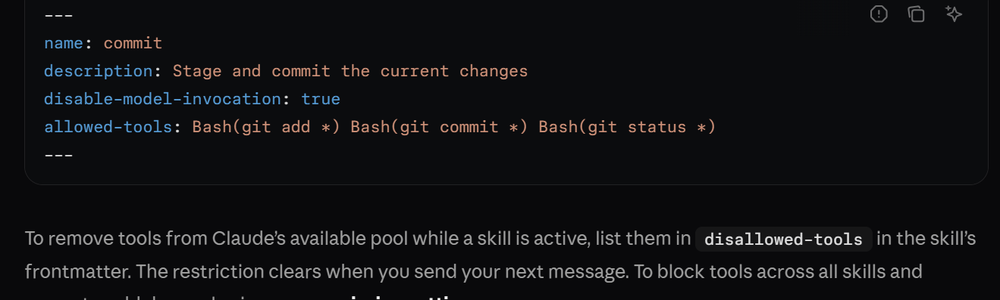
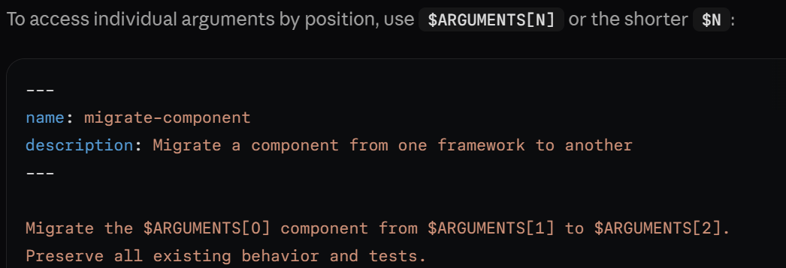
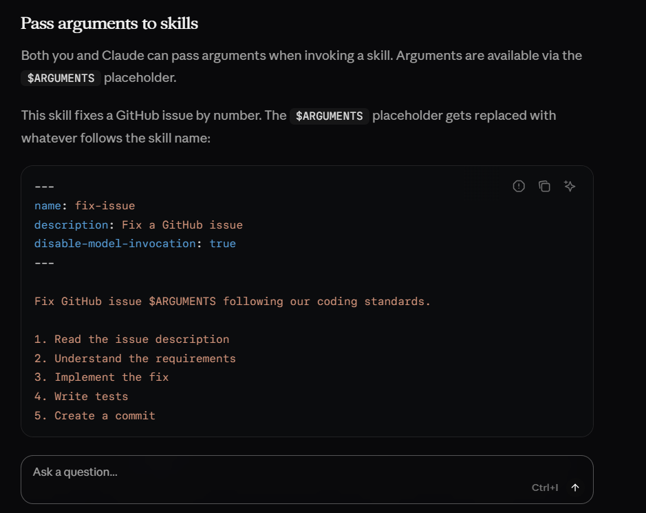

# WEEK5

## Having my-skill/ folder
And making all the documenttions be linked to a short table in the starting eith oly title nd link to the material for quick refernce without needing to go for the reading of the whole documentation.  reference by ids.

Example: Loading a PDF processing skill
Here's how Claude loads and uses a PDF processing skill:
Startup: System prompt includes: PDF Processing - Extract text and tables from PDF files, fill forms, merge documents
User request: "Extract the text from this PDF and summarize it"
Claude invokes: bash: read pdf-skill/SKILL.md → Instructions loaded into context
Claude determines: Form filling is not needed, so FORMS.md is not read
Claude executes: Uses instructions from SKILL.md to complete the task

The diagram shows:

Default state with system prompt and skill metadata pre-loaded
Claude triggers the skill by reading SKILL.md via bash
Claude optionally reads additional bundled files like FORMS.md as needed
Claude proceeds with the task

Extra features: 
Invocation control: disable-model-invocation (only you can trigger it, e.g. /deploy — you don't want the model deciding to deploy) vs. user-invocable: false (only the model, for background knowledge).
Arguments: /fix-issue 123 substitutes 123 into the body via a $ARGUMENTS placeholder.
Dynamic context: a !`git diff HEAD` line in the body runs before the model sees it, so the skill arrives with live data already inlined.
allowed-tools: pre-approving specific tools while a skill is active, so it doesn't re-prompt.
Running in a subagent (context: fork): the skill body becomes a fresh subagent's whole task — the exact Explore-subagent pattern from Week 4 Lesson 5.
 

 
 

 https://code.claude.com/docs/en/skills#control-who-invokes-a-skill