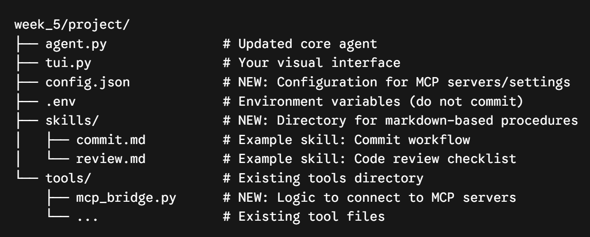

# Week 5 

new architecture

Here is a comprehensive breakdown of everything we have built for your Week 5 Capstone, how it functions, and the specific engineering problems it solves.You have successfully transformed Code Scout from a rigid, hardcoded script into a modular, extensible AI platform.1. The Skills Engine (skills/ directory & load_skill)What we did: We created a skills/ directory to store Markdown files (like commit.md and review.md) and added a load_skill tool to agent.py.
How it works: Instead of hardcoding complex instructions into Python, you write plain-English runbooks in Markdown. When the user asks the agent to perform a specific task, the agent uses load_skill to read the file and dynamically injects those instructions into its active memory.
Problems it solves:  System Prompt Bloat: If you put every rule for every task into the main system prompt, the AI gets confused and consumes too many tokens (costing money and slowing it down). This solves that via Progressive Disclosure—the agent only loads the rules for code reviews when it is actually doing a code review.Zero-Code Extensibility: You can now teach the agent new behaviors (e.g., how to deploy to AWS, how to write a specific type of test) simply by dropping a new .md file into the folder, without writing a single line of Python.2. Configuration as Code (config.json)What we did: We moved tool registries and active skills out of the Python code and into a central config.json file.
How it works: When agent.py boots up, it reads this JSON file to understand which external servers (like GitHub) and skills it should load.
Problems it solves:  Hardcoding Brittleness: Previously, adding a new tool meant digging into agent.py, updating dictionaries, and importing new modules. Now, your agent is a generic "engine" that configures itself based on this file.Scalability: If you want to share this agent with a teammate, they can customize their own config.json without breaking the core application.3. Model Context Protocol (MCP) Integration (mcp_bridge.py)What we did: We implemented an asynchronous MCP Manager that reads your config file and connects to standard MCP servers using the mcp Python SDK.How it works: The bridge spins up a secure connection (via stdio) to external applications like the github-mcp-server. It queries the server for its available tools, translates them into a format the OpenAI/DeepSeek model understands, and routes the AI's commands back to the server.Problems it solves:The "API Wrapper" Nightmare: Historically, if you wanted your agent to use GitHub, you had to write hundreds of lines of code to handle GitHub's API, authentication, and error handling. MCP standardizes this.Infinite Capabilities: Because of this bridge, your agent can now connect to any MCP-compliant server in the world (e.g., Slack, PostgreSQL, Google Drive) just by adding three lines to your config.json.4. Enterprise-Grade Security (.env integration)What we did: We separated your sensitive credentials (like the GitHub Personal Access Token) from the source code.How it works: Your config.json points to an environment variable, and the MCPManager pulls the actual secret key from your hidden .env file at runtime to authenticate the connection.Problems it solves:Credential Leaks: Hardcoding API keys in code or config files is the #1 way developers get hacked when they push code to GitHub. Your system is now secure by default.The Final Result: What Code Scout Can Do NowBy combining these four elements, your agent is now capable of highly complex, autonomous workflows.Example of an unlocked capability:You can tell Code Scout: "Review the recent changes in my repo and open a GitHub issue if there are bugs."Skills: It will use load_skill to read review.md, giving it a strict checklist of what constitutes a bug.Core Tools: It will use its native run_command and read_file tools to analyze your local code.  MCP Tools: It will use the GitHub MCP server to securely log into your GitHub account and execute the create_issue tool, all completely autonomously.
